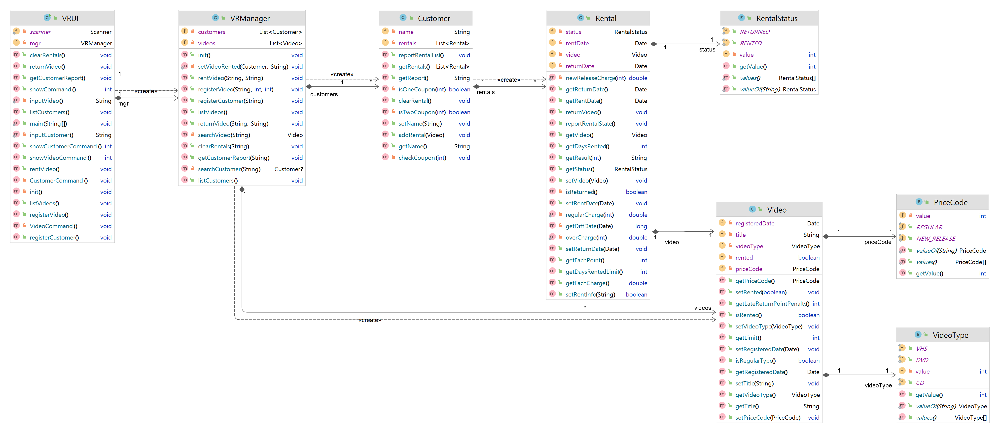

# 2022년 B4차 6조 재설계 - Video Rental 과제 

## Detected smells
- Long Method
- Large Class
- God Class
- Primitive Obsession
- Switch Statement
- Duplicate Code
- Shotgun Surgery

## Prioritization of the detected smells
|   Detected Smells   | Prioritization |                                  Comments                                  |
|:-------------------:|:--------------:|:--------------------------------------------------------------------------:|
| Long Method         |       하       | SRP에 준수하여 기능 및 코드 분할                                           |
| Large Class         |       중       | VRUI 클래스를 역할 별로 분리한다.                                          |
| God Class           |       상       | VRUI의 Presentation과 Business logic 분리 필요                             |
| Primitive Obsession |       중       | Video Class 내 PriceCode, Type의 Enum Class 선언                           |
| Switch Statement    |       하       | VRUI Command 별 카테고리화를 통한 case 복잡도 개선 (Customer, Video, Quit) |
| Duplicate Code      |       중       | Video Class내의 멤버 함수로 정의 (SRP 준수)                                |
| Shotgun Surgery     |       상       | 흩어진 변경 기능을 하나의 클래스에 모아서 응집도 높임.                     |

## Class Diagram
- Original Project

- Refactoring Project

## How we refactored code smells
- God Class & Large Class
  - VRUI : VRManager Class 생성 및 Domain Logic 위임
    - VRUI : Console 입력(Command, Customer, Video 입력)
    - VRManager : VRUI에서 Command별 메소드 구현
- Shotgun Surgery
  - VRUI/Rental : VRManager(기존 VRUI)와 Rental Class 간의 관계 단절
    - 기존 : VRManager에서 Rental Instance 생성 후 Customer의 Rentals 멤버 수정
    - 변경 : Rental Instance 생성을 Customer에 위임
- Duplicate Code
  - Customer 찾는 로직 추출
  - if/else 내 중복 수행 코드 추출
- Primitive Obsession
  - Enum Class 생성 : VideoType, PriceCode, RentalStatus
  - one-day -> msec 변환 식 상수화
    - public static final int ONE_DAY_MS = 1000 * 60 * 60 * 24;
- Long Method
  - Customer.getReport : 비용, 포인트 계산식을 Rental Class로 이동
  - VRUI.register : Customer, Video 각각의 Register Method로 분리
- Switch Statement
  - main 내 command 관련 switch : Customer, Video 별 Command로 카테고리화 하여 Switch 문을 역할별로 분리

